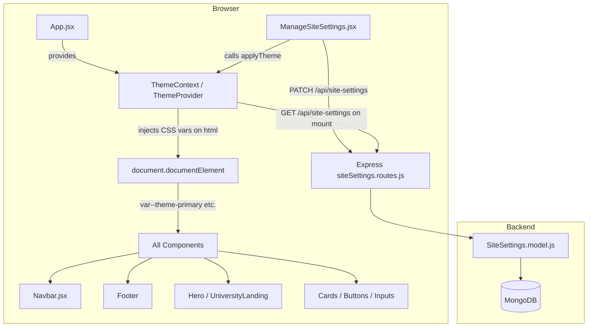

# Design Document: Theme Management

## Overview

The Theme Management feature allows the E-portal administrator to update the website's global color palette from the admin panel without touching any code. A small set of named design tokens (Primary, Secondary, Accent, Background Light/Dark, Card Light/Dark, Text Color, Border Color) are persisted in MongoDB via the existing `SiteSettings` model, served to the React frontend on every page load, and injected as CSS custom properties on the `<html>` element so that every component — Navbar, Footer, Hero, Cards, Buttons, Links — picks up the new colors automatically. Optional per-section overrides (Hero gradient, Footer background) let the admin fine-tune specific areas without disturbing the rest of the palette.

The feature extends three already-existing layers: the `SiteSettings` Mongoose model (a `theme` sub-document already exists), the `siteSettings.routes.js` REST endpoint (`GET /api/site-settings` + `PATCH /api/site-settings`), and the `ManageSiteSettings.jsx` admin component (a "Theme Colors" tab stub is already defined). New work is a `ThemeContext` React context + a `useTheme` hook, CSS variable wiring in `index.css`, and an enriched "Theme Colors" UI panel.

---

## Architecture



---

## Sequence Diagrams

### Initial Page Load – Theme Application

```mermaid
sequenceDiagram
    participant Browser
    participant ThemeProvider
    participant API as GET /api/site-settings
    participant MongoDB

    Browser->>ThemeProvider: App mounts
    ThemeProvider->>API: fetch site settings
    API->>MongoDB: SiteSettings.findOne()
    MongoDB-->>API: settings doc (incl. theme)
    API-->>ThemeProvider: { theme: { primary, secondary, ... } }
    ThemeProvider->>Browser: document.documentElement.style.setProperty(--theme-primary, #04065c)
    note over Browser: All components now use CSS vars; page renders with correct colors
```

### Admin Updates Theme

```mermaid
sequenceDiagram
    participant Admin as Admin Browser
    participant ManageSiteSettings
    participant ThemeProvider
    participant API as PATCH /api/site-settings
    participant MongoDB

    Admin->>ManageSiteSettings: Opens "Theme Colors" tab, picks new Primary Color
    Admin->>ManageSiteSettings: Clicks "Save Changes"
    ManageSiteSettings->>API: PATCH { theme: { primary: "#2d6a4f", ... } }
    API->>MongoDB: settings.theme = merged; settings.save()
    MongoDB-->>API: updated settings doc
    API-->>ManageSiteSettings: 200 OK — updated settings
    ManageSiteSettings->>ThemeProvider: applyTheme(updatedTheme)
    ThemeProvider->>Admin: document.documentElement.style.setProperty(--theme-primary, #2d6a4f)
    note over Admin: All buttons, navbar, cards instantly turn green — no reload needed
```

---

## Components and Interfaces

### ThemeProvider (new — `src/context/ThemeContext.jsx`)

**Purpose**: Central owner of the active theme. Fetches settings on mount, exposes the current theme object, and provides `applyTheme()` so any child (including `ManageSiteSettings`) can push a live update.

**Interface**:
```typescript
interface ThemeColors {
  primary:     string   // e.g. "#04065c"
  secondary:   string   // e.g. "#023e8a"
  accent:      string   // e.g. "#48cae4"
  bgLight:     string   // page / light-section background
  bgDark:      string   // dark sections background
  cardBg:      string   // card surface (light)
  cardDark:    string   // card surface (dark variant)
  textColor:   string   // body text
  borderColor: string   // border / divider lines
  heroFrom?:   string   // optional Hero gradient start (overrides primary)
  heroTo?:     string   // optional Hero gradient end (overrides secondary)
  footerBg?:   string   // optional Footer bg override
}

interface ThemeContextValue {
  theme:      ThemeColors
  applyTheme: (colors: Partial<ThemeColors>) => void
}
```

**Responsibilities**:
- Call `GET /api/site-settings` once on mount and extract the `theme` sub-object
- Call `applyTheme(theme)` immediately after fetch to hydrate CSS variables
- Expose `applyTheme` so `ManageSiteSettings` can call it after a successful save — giving instant live preview
- Fall back to the default Persian Blue palette if the API call fails

### ThemeContext CSS Variable Bridge

**Purpose**: Maps `ThemeColors` keys to CSS custom properties on `document.documentElement`.

**Mapping**:
```
theme.primary     → --theme-primary
theme.secondary   → --theme-secondary
theme.accent      → --theme-accent
theme.bgLight     → --theme-bg-light
theme.bgDark      → --theme-bg-dark
theme.cardBg      → --theme-card-bg
theme.cardDark    → --theme-card-dark
theme.textColor   → --theme-text
theme.borderColor → --theme-border
theme.heroFrom    → --theme-hero-from   (falls back to primary if empty)
theme.heroTo      → --theme-hero-to     (falls back to secondary if empty)
theme.footerBg    → --theme-footer-bg   (falls back to primary if empty)
```

### ManageSiteSettings – Theme Colors Tab (extended)

**Purpose**: Admin UI for viewing and editing the theme palette. Already has a stub tab "🎨 Theme Colors" — this extends it with a full color-picker grid, section overrides, and a live preview strip.

**Interface** (component props — none, it reads from context & API):
```typescript
// Internal form state shape for the theme tab
interface ThemeFormState extends ThemeColors {
  // no extra fields; heroFrom / heroTo / footerBg are optional
}
```

**Responsibilities**:
- Render a labeled `<input type="color">` + hex text field for each of the 9 global tokens
- Render collapsible "Section Overrides" for Hero and Footer
- Show a live preview strip reflecting the currently edited colors (before saving)
- On save, include `theme: JSON.stringify(themeForm)` in the FormData PATCH, then call `applyTheme()` from `ThemeContext`

### SiteSettings REST Endpoint (existing — extended)

**Purpose**: Persists and serves theme colors alongside all other site settings.

**Existing endpoints**:
- `GET /api/site-settings` — public, returns full settings doc including `theme`
- `PATCH /api/site-settings` — admin-only, merges partial updates including `theme`

**No new endpoints required.** The existing PATCH handler already deep-merges the `theme` sub-document.

---

## Data Models

### SiteSettings.theme (MongoDB sub-document — already exists, shown for reference)

```javascript
// backend/models/SiteSettings.model.js — theme sub-document
{
  primary:     String  // default: '#04065c'
  secondary:   String  // default: '#023e8a'
  accent:      String  // default: '#48cae4'
  bgLight:     String  // default: '#f0f9ff'
  bgDark:      String  // default: '#04065c'
  cardBg:      String  // default: '#ffffff'
  cardDark:    String  // default: '#023e8a'
  textColor:   String  // default: '#1e293b'
  borderColor: String  // default: '#caf0f8'
  heroFrom:    String  // default: '' (empty = use primary)
  heroTo:      String  // default: '' (empty = use secondary)
  footerBg:    String  // default: '' (empty = use primary)
}
```

**Validation Rules**:
- All color values must be valid 3- or 6-character hex strings (`#rgb` or `#rrggbb`)
- Empty string is valid for optional section overrides (treated as "use global")
- The `theme` sub-document is not required to be complete — missing fields fall back to defaults

### CSS Custom Properties (frontend — `index.css`)

```css
:root {
  /* ── Theme CSS variables (injected dynamically by ThemeContext) ── */
  --theme-primary:     #04065c;
  --theme-secondary:   #023e8a;
  --theme-accent:      #48cae4;
  --theme-bg-light:    #f0f9ff;
  --theme-bg-dark:     #04065c;
  --theme-card-bg:     #ffffff;
  --theme-card-dark:   #023e8a;
  --theme-text:        #1e293b;
  --theme-border:      #caf0f8;
  --theme-hero-from:   #04065c;
  --theme-hero-to:     #023e8a;
  --theme-footer-bg:   #04065c;

  /* Gradient helpers — reference the vars above */
  --theme-grad-primary: linear-gradient(135deg, var(--theme-primary), var(--theme-secondary));
  --theme-grad-hero:    linear-gradient(135deg, var(--theme-hero-from), var(--theme-hero-to));
  --theme-grad-footer:  linear-gradient(135deg, var(--theme-footer-bg), var(--theme-primary));
}
```

> **Note**: These variables already exist in `index.css`. They serve as the initial fallback values. `ThemeProvider` overwrites them at runtime.

---

## Algorithmic Pseudocode

### Algorithm 1: applyTheme — Inject CSS Variables

```pascal
PROCEDURE applyTheme(colors: ThemeColors)
  INPUT: colors — partial or full ThemeColors object
  OUTPUT: side-effect — CSS custom properties set on document root

  PRECONDITION: document.documentElement is accessible (browser environment)
  POSTCONDITION:
    FOR EACH variable IN CSS_VAR_MAP DO
      document.documentElement.style.getPropertyValue(variable) = colors[corresponding_key]
    END FOR

  SEQUENCE
    root ← document.documentElement

    // Map each ThemeColors key to its CSS variable name
    VAR_MAP ← {
      primary:     '--theme-primary',
      secondary:   '--theme-secondary',
      accent:      '--theme-accent',
      bgLight:     '--theme-bg-light',
      bgDark:      '--theme-bg-dark',
      cardBg:      '--theme-card-bg',
      cardDark:    '--theme-card-dark',
      textColor:   '--theme-text',
      borderColor: '--theme-border',
      heroFrom:    '--theme-hero-from',
      heroTo:      '--theme-hero-to',
      footerBg:    '--theme-footer-bg',
    }

    FOR EACH (key, cssVar) IN VAR_MAP DO
      value ← colors[key]

      // Section overrides: fall back to global if empty/undefined
      IF key = 'heroFrom' AND (value IS NULL OR value = '') THEN
        value ← colors.primary
      END IF
      IF key = 'heroTo' AND (value IS NULL OR value = '') THEN
        value ← colors.secondary
      END IF
      IF key = 'footerBg' AND (value IS NULL OR value = '') THEN
        value ← colors.primary
      END IF

      IF value IS NOT NULL AND value ≠ '' THEN
        root.style.setProperty(cssVar, value)
      END IF
    END FOR
  END SEQUENCE
END PROCEDURE
```

**Loop Invariant**: For every `(key, cssVar)` pair processed so far, `document.documentElement` has the correct value set for `cssVar`.

---

### Algorithm 2: ThemeProvider Initialization

```pascal
PROCEDURE ThemeProvider_onMount()
  INPUT: none
  OUTPUT: theme state set; CSS variables injected

  SEQUENCE
    TRY
      response ← AWAIT api.get('/site-settings')
      settings ← response.data

      IF settings.theme EXISTS THEN
        mergedTheme ← MERGE(DEFAULT_THEME, settings.theme)
      ELSE
        mergedTheme ← DEFAULT_THEME
      END IF

      setTheme(mergedTheme)
      applyTheme(mergedTheme)

    CATCH error
      // API unavailable — silently use defaults already in CSS
      setTheme(DEFAULT_THEME)
      applyTheme(DEFAULT_THEME)
    END TRY
  END SEQUENCE
END PROCEDURE
```

**Preconditions**: `DEFAULT_THEME` constant defined with all 12 color keys.
**Postconditions**: `theme` state is set; CSS vars reflect the active palette.

---

### Algorithm 3: Admin Save Theme

```pascal
PROCEDURE handleThemeSave(themeForm: ThemeColors)
  INPUT: themeForm — object with all ThemeColors fields from the admin UI form
  OUTPUT: settings persisted in DB; CSS variables updated live

  PRECONDITION: user IS authenticated AND user.role = 'admin'
  POSTCONDITION:
    - MongoDB SiteSettings.theme = themeForm (merged)
    - All CSS custom properties on document root reflect themeForm values
    - No full page reload required

  SEQUENCE
    setLoading(true)

    data ← new FormData()
    data.append('theme', JSON.stringify(themeForm))

    TRY
      response ← AWAIT api.patch('/site-settings', data, { multipart: true })
      updatedSettings ← response.data

      // Update local form to reflect persisted values
      setForm(prev → { ...prev, theme: updatedSettings.theme })

      // Live-apply theme — all components update immediately
      applyTheme(updatedSettings.theme)

      showMessage('success', '✅ Theme saved! Website colors updated instantly.')

    CATCH err
      showMessage('error', err.message OR 'Failed to save theme')

    FINALLY
      setLoading(false)
    END TRY
  END SEQUENCE
END PROCEDURE
```

**Loop Invariants**: N/A (no loops).

---

### Algorithm 4: validateHexColor

```pascal
FUNCTION validateHexColor(value: String) RETURNS Boolean
  INPUT: value — a string representing a color
  OUTPUT: true if value is a valid CSS hex color, false otherwise

  PRECONDITION: value is a String (may be empty)
  POSTCONDITION: returns true iff value matches /^#([0-9A-Fa-f]{3}|[0-9A-Fa-f]{6})$/

  SEQUENCE
    IF value IS NULL OR value = '' THEN
      RETURN true    // empty is valid (optional override — falls back to global)
    END IF

    pattern ← /^#([0-9A-Fa-f]{3}|[0-9A-Fa-f]{6})$/
    RETURN pattern.test(value)
  END SEQUENCE
END FUNCTION
```

---

## Key Functions with Formal Specifications

### `applyTheme(colors)`

```javascript
function applyTheme(colors: Partial<ThemeColors>): void
```

**Preconditions:**
- Called in a browser environment (`document` is defined)
- `colors` is a non-null object

**Postconditions:**
- For each key in `CSS_VAR_MAP`, the corresponding CSS variable on `document.documentElement` equals `colors[key]` (or the global fallback if the key is an empty section override)
- No network requests are made
- No React state updates occur inside this function (pure DOM side-effect)

---

### `useTheme()` hook

```javascript
function useTheme(): ThemeContextValue
```

**Preconditions:**
- Called inside a component that is a descendant of `<ThemeProvider>`

**Postconditions:**
- Returns `{ theme, applyTheme }` where `theme` is the current active `ThemeColors` object

---

### Backend: PATCH `/api/site-settings` — theme merge

```javascript
// siteSettings.routes.js — existing handler (no change needed)
// When req.body.theme is present:
const t = JSON.parse(req.body.theme)           // parse JSON string
settings.theme = { ...settings.theme, ...t }   // shallow merge (all 12 keys present)
await settings.save()
```

**Preconditions:**
- `req.user` exists and has `role === 'admin'` (enforced by `adminOnly` middleware)
- `req.body.theme` is a valid JSON string representing a `ThemeColors`-shaped object

**Postconditions:**
- `settings.theme` in MongoDB contains the merged result of the previous theme and the new values
- Returns the full updated `SiteSettings` document

---

## Example Usage

```jsx
// 1. Wrap App with ThemeProvider
// src/App.jsx
import { ThemeProvider } from './context/ThemeContext'

function App() {
  return (
    <ThemeProvider>
      <Navbar />
      <Outlet />
    </ThemeProvider>
  )
}

// 2. Use CSS variables in any component — no import needed
// src/components/Navbar.jsx
<nav style={{ background: 'var(--theme-primary)' }}>
  <button style={{ color: 'var(--theme-accent)' }}>Login</button>
</nav>

// 3. Use theme hook for dynamic JS color values if needed
// src/components/SomeChart.jsx
import { useTheme } from '../context/ThemeContext'

function SomeChart() {
  const { theme } = useTheme()
  return <PieChart color={theme.accent} />
}

// 4. Admin changes theme — live update, no reload
// src/components/dashboard/ManageSiteSettings.jsx (Theme tab)
import { useTheme } from '../../context/ThemeContext'

function ThemeTab({ form, set }) {
  const { applyTheme } = useTheme()

  const handleColorChange = (key, value) => {
    set('theme', { ...form.theme, [key]: value })
    applyTheme({ ...form.theme, [key]: value })  // instant live preview
  }

  return (
    <div className="grid gap-4 sm:grid-cols-3">
      {THEME_TOKENS.map(token => (
        <div key={token.key}>
          <label>{token.label}</label>
          <input
            type="color"
            value={form.theme?.[token.key] || token.default}
            onChange={e => handleColorChange(token.key, e.target.value)}
          />
        </div>
      ))}
    </div>
  )
}
```

---

## Correctness Properties

### Property 1: Global Propagation

For every UI component that uses `var(--theme-primary)` (Navbar, buttons, badges, etc.), changing `theme.primary` and calling `applyTheme()` MUST cause all those elements to render the new color without a page reload.

**Validates: Requirements 5.1, 5.2, 5.3, 5.4, 5.5**

### Property 2: Section Override Independence

Changing `theme.heroFrom` / `theme.heroTo` MUST only affect the Hero section gradient and MUST NOT change any other component's primary color.

**Validates: Requirements 6.1, 6.5**

### Property 3: Empty Override Fallback

If `theme.heroFrom` is an empty string, the Hero gradient start MUST fall back to `theme.primary` — it MUST NOT render as transparent or black. Formally: `applyTheme({ primary: p, heroFrom: "" })` → `getPropertyValue("--theme-hero-from") === p`.

**Validates: Requirements 2.4, 6.2, 6.4**

### Property 4: Default Resilience

If `GET /api/site-settings` fails (network error, server down), the site MUST still render with the CSS default values defined in `index.css` — no blank/unstyled page.

**Validates: Requirements 9.1, 9.2, 9.3**

### Property 5: Admin-Only Mutation

`PATCH /api/site-settings` MUST return `403 Forbidden` for any authenticated non-admin user and `401 Unauthorized` for unauthenticated requests.

**Validates: Requirements 8.1, 8.2**

### Property 6: Hex Validation Completeness

`validateHexColor(s)` returns `true` iff `s === ""` or `s` matches `^#[0-9A-Fa-f]{3}$` or `^#[0-9A-Fa-f]{6}$`. For any other string it MUST return `false`. This is amenable to property-based testing (fast-check): generate arbitrary strings and verify the predicate matches the regex.

**Validates: Requirements 7.1, 7.2**

### Property 7: Live Preview Performance

Calling `applyTheme()` with any valid `ThemeColors` object completes within a single animation frame (< 16ms) because it makes at most 12 synchronous `style.setProperty` calls with no network I/O.

**Validates: Requirements 4.3**

### Property 8: Idempotency

For any `ThemeColors` object `t`, calling `applyTheme(t)` twice in a row MUST produce the same CSS variable state as calling it once. No state accumulation or corruption occurs.

**Validates: Requirements 2.3**

---

## Error Handling

### Scenario 1: API fetch fails on page load

**Condition**: `GET /api/site-settings` returns 5xx or network timeout during `ThemeProvider` mount.
**Response**: Catch the error silently; initialize `theme` state with `DEFAULT_THEME`.
**Recovery**: CSS variables in `index.css` already have the default Persian Blue palette as fallback values, so the site renders normally. No error message is shown to end users.

### Scenario 2: Admin saves invalid hex color

**Condition**: Admin manually types an invalid value in the hex text input (e.g., `"notacolor"`).
**Response**: Frontend `validateHexColor()` returns `false`; the Save button is disabled until all values are valid. The invalid field shows a red border + tooltip "Enter a valid hex color (#rrggbb)".
**Recovery**: Admin corrects the value; validation passes; save proceeds normally.

### Scenario 3: PATCH request fails (network / server error)

**Condition**: `PATCH /api/site-settings` returns 4xx / 5xx or times out.
**Response**: Show error message in the existing `msg` state: `"❌ Failed to save theme. Please try again."`. CSS variables remain at their current (pre-save) values since `applyTheme()` was only called for live preview.
**Recovery**: Admin retries the save.

### Scenario 4: Missing `theme` field in stored settings

**Condition**: Old `SiteSettings` document in MongoDB was created before the `theme` sub-document was added.
**Response**: `ThemeProvider` detects `settings.theme` is `null` / `undefined` and falls back to `DEFAULT_THEME`.
**Recovery**: When admin saves any theme change, the `theme` sub-document is created and persisted for future loads.

---

## Testing Strategy

### Unit Testing Approach

- Test `applyTheme()` in isolation by calling it with a mock `ThemeColors` object and asserting `document.documentElement.style.getPropertyValue(cssVar) === expectedValue` for each key.
- Test `validateHexColor()` with valid inputs (`#fff`, `#04065c`), invalid inputs (`notacolor`, `#zzzzzz`, empty string → valid), and edge cases (`#FFFFFF` uppercase).
- Test the `ThemeProvider` mount behavior by mocking `api.get` to return a settings object and verifying the context value matches.

### Property-Based Testing Approach

**Property Test Library**: fast-check (already used in the React/Vite stack pattern)

- **Property**: For any valid 6-character hex string `c`, `applyTheme({ primary: c })` followed by `getComputedStyle(root).getPropertyValue('--theme-primary')` equals `c`.
- **Property**: For any `ThemeColors` object `t` where all values are valid hex, `applyTheme(t)` is idempotent — calling it twice produces the same DOM state.
- **Property**: `validateHexColor(s)` returns `true` iff `s` matches `^#[0-9A-Fa-f]{3,6}$` or `s === ''`.

### Integration Testing Approach

- Test the full round-trip: render `<ThemeProvider>` with a mocked API returning a custom theme → assert CSS variables are applied → simulate a save from `ManageSiteSettings` → assert variables updated.
- Test the `PATCH /api/site-settings` route with a test MongoDB instance: send a valid `theme` JSON body → assert the saved document's `theme` sub-document matches the sent values.
- Test role-based access: a student JWT → `PATCH` returns 403; admin JWT → `PATCH` succeeds.

---

## Performance Considerations

- `applyTheme()` calls `element.style.setProperty()` up to 12 times in a single synchronous loop. This is a trivially fast DOM operation (< 1ms) — no debouncing is needed for the live preview.
- `GET /api/site-settings` is already called on every page load by both `Navbar.jsx` and `ManageSiteSettings.jsx`. `ThemeProvider` will consolidate this to a single call, and components that previously fetched settings independently can read from context instead, reducing redundant API calls.
- Theme data is tiny (≤ 1KB); no caching layer is needed beyond the existing browser HTTP cache on the settings endpoint.

---

## Security Considerations

- The `theme` object contains only color hex strings — no executable code. No XSS vector exists from injecting theme values as CSS custom properties (CSS variables cannot execute scripts).
- The `PATCH /api/site-settings` route is already protected by `protect` + `adminOnly` middleware. No changes needed.
- Input validation on the frontend (`validateHexColor`) prevents garbage data from reaching the database, keeping the stored palette clean.

---

## Dependencies

| Dependency | Already Installed? | Purpose |
|---|---|---|
| React Context API | ✅ Yes (used by AuthContext) | ThemeProvider / useTheme |
| `api` utility (`src/utils/api.js`) | ✅ Yes | Fetch site settings |
| CSS Custom Properties | ✅ Yes (index.css already has vars) | Runtime theme injection |
| Mongoose `SiteSettings` model | ✅ Yes (theme sub-doc exists) | Persist theme |
| `siteSettings.routes.js` | ✅ Yes (theme merge in PATCH exists) | REST API |
| `<input type="color">` | ✅ Built-in HTML | Color picker UI |
| fast-check | ❌ Optional — only if PBT tests are written | Property-based testing |
